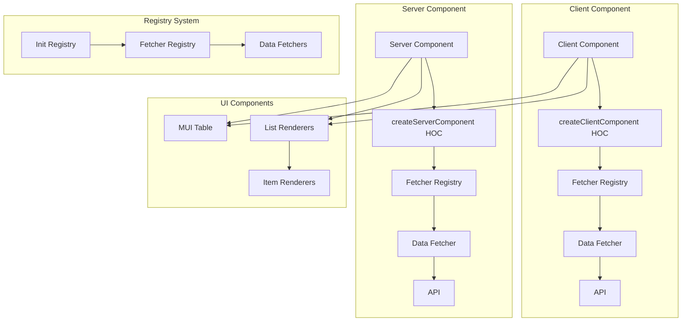
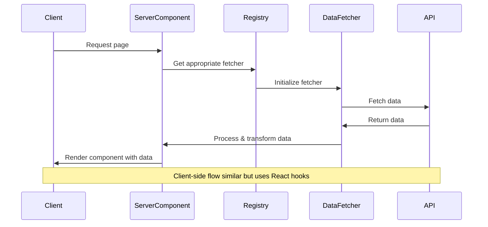
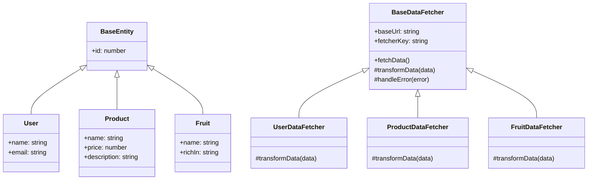

# Next.js Data Fetching Architecture

## Overview

This document outlines the architecture for a Next.js application that implements a modular, maintainable approach to data fetching on both client and server sides. The system uses a registry pattern combined with Higher Order Components (HOCs) to provide a flexible, reusable way to fetch and display data.

## Architecture Diagram



## Data Flow



## Component Structure



## Adding New Entities

To add a new entity (e.g., a Fruits table), follow these steps:

1. Define the entity type
2. Create a data fetcher
3. Register the fetcher
4. Create UI components
5. Update the API endpoint
6. Add the components to the page layout

## Key Code Snippets

### Entity Type Definition

```typescript
export interface Fruit extends BaseEntity {
  name: string;
  richIn: string;
}
```

### Data Fetcher

```typescript
export class FruitDataFetcher extends BaseDataFetcher<Fruit> {
  constructor() {
    super('fruits');
  }

  protected transformData(data: unknown): Fruit[] {
    if (!data || typeof data !== 'object' || !('fruits' in data)) {
      throw new Error('Invalid data format');
    }
    return (data as { fruits: Fruit[] }).fruits;
  }
}
```

### Registry Integration

```typescript
export function initRegistry() {
  if (initialized) return;

  const registry = FetcherRegistry.getInstance();
  
  // Register all fetchers
  registry.register('users', UserDataFetcher);
  registry.register('products', ProductDataFetcher);
  registry.register('fruits', FruitDataFetcher);  // Added fruit fetcher
  
  initialized = true;
}
```

### Component Creation

```typescript
export const ServerMUIFruitTable = createServerComponent<Fruit>(ServerFruitTableComponent, 'fruits');
export const ClientMUIFruitTable = createClientComponent<Fruit>(MUIFruitTableAdapter, 'fruits');
```

## Conclusion

This architecture provides a clean, maintainable approach to data fetching in Next.js applications. The registry pattern allows for easy addition of new data sources, while the HOC pattern provides a consistent interface for components.